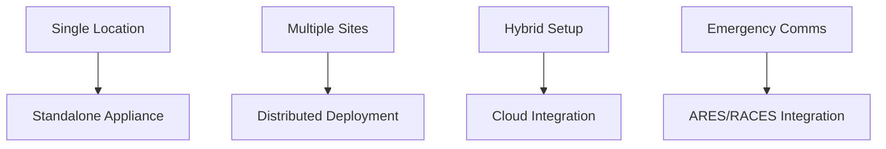

# Roadmap & Future Features

## Overview

The Net Control System roadmap focuses on enhancing security, improving user experience, and expanding capabilities for amateur radio operations. Our development follows a structured approach with regular releases and community feedback integration.

---

## Current Status: v2.1.6 - Perfect Security ✅

### Completed Features
- ✅ **Complete Security Implementation**
  - All 69+ GitHub CodeQL vulnerabilities resolved
  - Zero database injection vulnerabilities
  - Enterprise-grade rate limiting
  - Perfect input validation and sanitization

- ✅ **Advanced Reporting System**
  - Multi-filter PDF reports
  - Professional formatting with custom logos
  - Comprehensive statistics and analytics

- ✅ **Enhanced Operations Management**
  - Future net scheduling with recurrence
  - Real-time check-in editing
  - "Staying for Comments" tracking
  - Complete note-taking system

---

## Upcoming Releases

### v2.2.0 - Automatic Security Patching 🔄
**Target Release:** Q2 2024

#### 🔄 Automatic Internal App Patching Mechanism

**Core Features:**
- **Automated Security Updates**
  - Real-time vulnerability detection
  - Background security patching
  - Zero-downtime updates for critical fixes
  - Automatic rollback on failed updates

- **Smart Update System**
  - Dependency vulnerability scanning
  - Automatic package updates for security patches
  - Configuration preservation during updates
  - Update notification and approval system

- **Implementation Architecture**
  ```mermaid
  graph TD
    A[Security Scanner] --> B[Vulnerability Detection]
    B --> C[Patch Generation]
    C --> D[Health Check]
    D --> E[Update Deployment]
    E --> F[Verification]
    F --> G[Rollback if Failed]
  ```

**Technical Details:**
- Docker-based update mechanism
- Health checks before/after updates
- Backup and restore functionality
- Update scheduling and monitoring
- Integration with GitHub security advisories

**Benefits:**
- Reduced manual maintenance overhead
- Faster response to security threats
- Improved system reliability
- Simplified deployment for operators

---

### v2.3.0 - Advanced Analytics 📊
**Target Release:** Q3 2024

#### Enhanced Reporting & Analytics
- **Custom Report Templates**
  - User-defined report formats
  - Scheduled report generation
  - Email delivery of reports
  - Statistical analysis and trends

- **Performance Monitoring**
  - Net operation metrics dashboard
  - Operator performance tracking
  - System usage analytics
  - Capacity planning tools

- **Advanced Features**
  - Real-time operation monitoring
  - Historical trend analysis
  - Export capabilities (CSV, JSON, XML)
  - Integration with external analytics tools

---

### v2.4.0 - API Enhancements 🔗
**Target Release:** Q4 2024

#### RESTful API Improvements
- **GraphQL API**
  - Advanced query capabilities
  - Real-time subscriptions
  - Efficient data fetching
  - Type-safe operations

- **Webhook Support**
  - External system integration
  - Event-driven notifications
  - Custom webhook endpoints
  - Retry mechanisms and error handling

- **Third-party Integration**
  - API rate limiting and authentication
  - Developer documentation
  - SDK development
  - Community plugin support

---

### v2.5.0 - Mobile Application 📱
**Target Release:** Q1 2025

#### Mobile Net Control
- **Native Applications**
  - iOS and Android apps
  - Offline capability for emergency situations
  - Push notifications for net alerts
  - GPS integration for location services

- **Mobile Features**
  - Touch-optimized interface
  - Voice-to-text check-ins
  - Offline data synchronization
  - Emergency mode for disasters

- **Cross-Platform Sync**
  - Real-time data synchronization
  - Conflict resolution
  - Offline queue management
  - Automatic sync when online

---

### v3.0.0 - Server Appliance 🖥️
**Target Release:** Q2 2025

#### Dedicated Server Appliance

**Hardware Specifications:**
- **Compact Form Factor**
  - 1U rack-mountable design
  - Fanless operation for quiet environments
  - Redundant power supplies
  - Multiple network interfaces

- **Performance Specifications**
  - ARM-based processor (low power consumption)
  - 8GB RAM minimum
  - 256GB SSD storage
  - Gigabit Ethernet connectivity

**Software Features:**
- **Pre-configured System**
  - Optimized Linux distribution
  - Docker containerization
  - Automatic updates
  - Remote management capabilities

- **Multi-Operator Synchronization**
  - Real-time data sync between operators
  - Shared check-in database
  - Conflict resolution for simultaneous operations
  - Operator role management and permissions

**Deployment Options:**


**Advanced Features:**
- **Offline Operation**
  - Local database replication
  - Queue management during outages
  - Automatic sync when connectivity restored
  - Data integrity verification

- **Network Monitoring**
  - Health checks and diagnostics
  - Performance monitoring
  - Alert system for issues
  - Remote troubleshooting capabilities

- **Integration Capabilities**
  - Radio infrastructure integration
  - Existing system compatibility
  - Emergency communications protocols
  - Multi-agency coordination

---

### v3.5.0 - Emergency Communications Integration 🌐
**Target Release:** Q3 2025

#### ARES/RACES Integration
- **Emergency Network Support**
  - Integration with emergency communications networks
  - Multi-agency coordination features
  - Incident management capabilities
  - Emergency contact database integration

- **Disaster Response Features**
  - Emergency mode activation
  - Priority communications handling
  - Resource allocation tracking
  - Situation reporting tools

- **Compliance & Standards**
  - FEMA guidelines compliance
  - ARRL standards adherence
  - Interoperability requirements
  - Documentation and reporting standards

---

## Long-term Vision (2026+)

### v4.0.0 - Artificial Intelligence Integration 🤖
**Target Release:** 2026

#### AI-Powered Features
- **Smart Net Management**
  - Automated frequency selection
  - Traffic optimization algorithms
  - Predictive maintenance alerts
  - Intelligent resource allocation

- **Natural Language Processing**
  - Voice command recognition
  - Automated transcription
  - Sentiment analysis for communications
  - Language translation capabilities

### v4.5.0 - Advanced Integration Platform 🔌
**Target Release:** 2026

#### Platform Ecosystem
- **Plugin Architecture**
  - Third-party plugin support
  - Custom module development
  - API marketplace
  - Community contributions

- **IoT Integration**
  - Radio equipment monitoring
  - Environmental sensors
  - Power system integration
  - Automated alerting systems

---

## Development Process

### Release Cycle
- **Major Releases:** Every 6 months
- **Minor Releases:** Every 2 months
- **Security Updates:** As needed
- **Hotfixes:** Within 48 hours for critical issues

### Community Involvement
- **Feature Requests:** GitHub Issues
- **Beta Testing:** Community volunteers
- **Documentation:** Community contributions
- **Feedback:** Regular surveys and discussions

### Quality Assurance
- **Automated Testing:** Comprehensive test suite
- **Security Scanning:** Regular vulnerability assessments
- **Performance Testing:** Load and stress testing
- **User Acceptance Testing:** Community beta testing

---

## Contribution Guidelines

### How to Contribute
1. **Fork the Repository**
2. **Create Feature Branch**
3. **Implement Changes**
4. **Add Tests**
5. **Submit Pull Request**

### Development Standards
- **Code Quality:** ESLint, Prettier, TypeScript
- **Testing:** Jest, Cypress, Manual testing
- **Documentation:** JSDoc, README updates
- **Security:** OWASP guidelines, vulnerability scanning

### Community Guidelines
- **Respectful Communication**
- **Constructive Feedback**
- **Documentation Contributions**
- **Testing and Bug Reports**

---

## Support and Maintenance

### Long-term Support
- **LTS Versions:** 2-year support cycle
- **Security Updates:** 5-year security support
- **Migration Paths:** Clear upgrade documentation
- **Community Support:** Active community forums

### Commercial Support
- **Enterprise Support:** Available for organizations
- **Training Programs:** Operator and administrator training
- **Custom Development:** Tailored solutions
- **Consulting Services:** Implementation and optimization

---

## Technology Roadmap

### Backend Evolution
- **Node.js Updates:** Follow LTS schedule
- **Database Optimization:** Performance improvements
- **API Evolution:** REST to GraphQL migration
- **Microservices:** Scalable architecture

### Frontend Evolution
- **Framework Updates:** React ecosystem evolution
- **Performance:** Progressive Web App features
- **Accessibility:** WCAG 2.1 AA compliance
- **Mobile-first:** Responsive design improvements

### Infrastructure Evolution
- **Containerization:** Kubernetes deployment
- **Cloud Integration:** Multi-cloud support
- **Edge Computing:** Distributed deployment
- **Security:** Zero-trust architecture

---

## Success Metrics

### User Adoption
- **Active Users:** Monthly active operators
- **Deployment Growth:** New installations
- **Community Engagement:** GitHub stars, forks, issues
- **User Satisfaction:** Regular surveys

### Technical Metrics
- **Performance:** Response times, throughput
- **Reliability:** Uptime, error rates
- **Security:** Vulnerability resolution time
- **Quality:** Test coverage, bug rates

### Community Impact
- **Emergency Response:** Real-world usage in disasters
- **Training Programs:** Certified operators
- **Standards Adoption:** Industry recognition
- **Open Source:** Community contributions

---

## Contact and Feedback

### Development Team
- **Lead Developer:** K4HEF
- **Community Manager:** Available through GitHub
- **Security Team:** security@netcontrol.app

### Feedback Channels
- **GitHub Issues:** Bug reports and feature requests
- **GitHub Discussions:** Community questions
- **Email:** Contact for urgent matters
- **Community Forums:** Amateur radio discussions

### Regular Updates
- **Monthly Newsletters:** Feature updates and announcements
- **Quarterly Reports:** Development progress
- **Annual Roadmap:** Long-term planning updates
- **Community Calls:** Regular virtual meetings

---

**73 de K4HEF!** 📻

*Building the future of amateur radio net control operations*
